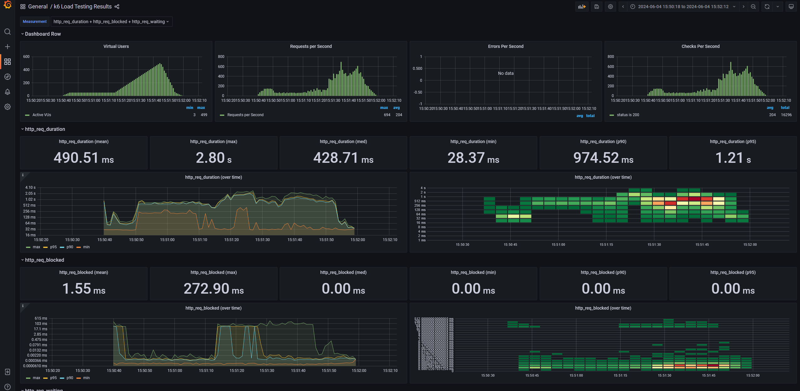
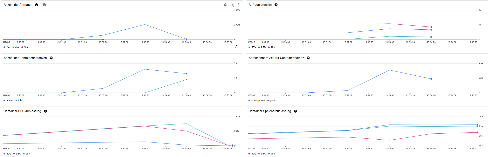
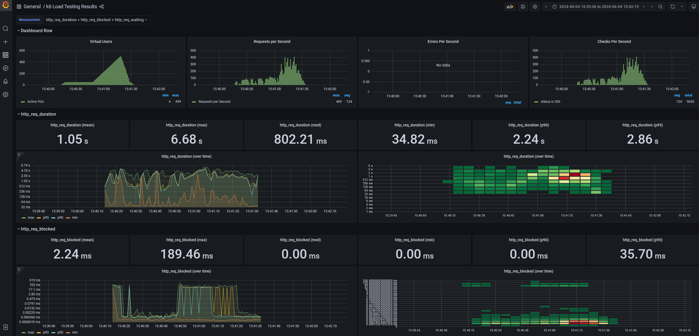
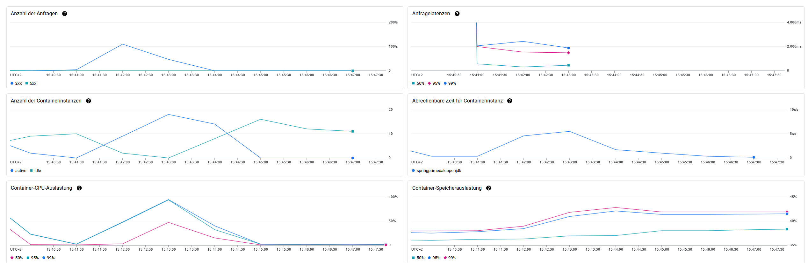

# Spring Native Benchmark

The purpose of this project is to determine the advantages of using GraalVM native AOT compilation in combination with Spring Boot. Specifically in cloud environments like Google Cloud 

## Creating an image

### Native with GraalVM
Create the native executable at target/springnativebenchmark

```
./mvn -Pnative native:compile
```

Create a native image

```
docker build -f src/main/docker/Dockerfile.native -t springnativebenchmark .
```

### JVM

Create a JAR file


```
./mvn package
```

Extract the JAR contents

```
java -Djarmode=layertools -jar target/*.jar extract --destination target/extracted
```

Create the JVM image

```
docker build -f src/main/docker/Dockerfile.jvm -t springnativebenchmarkjvm .
```

Pushing the Image to Google Artifact Registry

```
gcloud auth login
docker tag {Image Name} europe-west3-docker.pkg.dev/{Repository Name}
docker push europe-west3-docker.pkg.dev/{Repository Name}
```

## Results from testing with Google Cloud Run

### Native spring application

Tested with Parameters: ?startNumber=1000000000000&count=1





```bash
/home/k6 # k6 run /scripts/script_spring_native.js

          /\      |‾‾| /‾‾/   /‾‾/   
     /\  /  \     |  |/  /   /  /    
    /  \/    \    |     (   /   ‾‾\  
   /          \   |  |\  \ |  (‾)  | 
  / __________ \  |__| \__\ \_____/ .io

     execution: local
        script: /scripts/script_spring_native.js
        output: InfluxDBv1 (http://influxdb:8086)

     scenarios: (100.00%) 1 scenario, 500 max VUs, 1m50s max duration (incl. graceful stop):
              * default: Up to 500 looping VUs for 1m20s over 5 stages (gracefulRampDown: 30s, gracefulStop: 30s)


     ✓ status is 200

     checks.........................: 100.00% ✓ 16316      ✗ 0    
     data_received..................: 5.9 MB  73 kB/s
     data_sent......................: 1.9 MB  24 kB/s
     http_req_blocked...............: avg=1.54ms   min=86ns     med=284ns    max=272.9ms  p(90)=641ns    p(95)=1.26µs  
     http_req_connecting............: avg=683.94µs min=0s       med=0s       max=130.36ms p(90)=0s       p(95)=0s      
     http_req_duration..............: avg=490.47ms min=28.36ms  med=428.72ms max=2.8s     p(90)=974.41ms p(95)=1.2s    
       { expected_response:true }...: avg=490.47ms min=28.36ms  med=428.72ms max=2.8s     p(90)=974.41ms p(95)=1.2s    
     http_req_failed................: 0.00%   ✓ 0          ✗ 16316
     http_req_receiving.............: avg=521µs    min=13.63µs  med=81.38µs  max=51.67ms  p(90)=644.29µs p(95)=1.39ms  
     http_req_sending...............: avg=86.17µs  min=15.01µs  med=54.18µs  max=15.67ms  p(90)=140.06µs p(95)=202.95µs
     http_req_tls_handshaking.......: avg=840.63µs min=0s       med=0s       max=218.88ms p(90)=0s       p(95)=0s      
     http_req_waiting...............: avg=489.86ms min=28.24ms  med=427.48ms max=2.8s     p(90)=973.83ms p(95)=1.2s    
     http_reqs......................: 16316   203.260683/s
     iteration_duration.............: avg=792.98ms min=328.83ms med=731.28ms max=3.1s     p(90)=1.27s    p(95)=1.51s   
     iterations.....................: 16316   203.260683/s
     vus............................: 3       min=3        max=499
     vus_max........................: 500     min=500      max=500


running (1m20.3s), 000/500 VUs, 16316 complete and 0 interrupted iterations
default ✓ [======================================] 000/500 VUs  1m20s
```

### Non-native spring application

Tested with Parameters: ?startNumber=1000000000000&count=1





```bash
/home/k6 # k6 run /scripts/script_spring.js

          /\      |‾‾| /‾‾/   /‾‾/   
     /\  /  \     |  |/  /   /  /    
    /  \/    \    |     (   /   ‾‾\  
   /          \   |  |\  \ |  (‾)  | 
  / __________ \  |__| \__\ \_____/ .io

     execution: local
        script: /scripts/script_spring.js
        output: InfluxDBv1 (http://influxdb:8086)

     scenarios: (100.00%) 1 scenario, 500 max VUs, 1m50s max duration (incl. graceful stop):
              * default: Up to 500 looping VUs for 1m20s over 5 stages (gracefulRampDown: 30s, gracefulStop: 30s)


     ✓ status is 200

     checks.........................: 100.00% ✓ 9667       ✗ 0    
     data_received..................: 4.6 MB  57 kB/s
     data_sent......................: 1.4 MB  17 kB/s
     http_req_blocked...............: avg=2.23ms   min=90ns     med=245ns    max=189.45ms p(90)=582ns    p(95)=35.69ms 
     http_req_connecting............: avg=955.31µs min=0s       med=0s       max=96.81ms  p(90)=0s       p(95)=14.02ms 
     http_req_duration..............: avg=1.04s    min=34.81ms  med=802.21ms max=6.68s    p(90)=2.24s    p(95)=2.85s   
       { expected_response:true }...: avg=1.04s    min=34.81ms  med=802.21ms max=6.68s    p(90)=2.24s    p(95)=2.85s   
     http_req_failed................: 0.00%   ✓ 0          ✗ 9667 
     http_req_receiving.............: avg=133.44µs min=13.27µs  med=77.22µs  max=39.33ms  p(90)=151.77µs p(95)=322.28µs
     http_req_sending...............: avg=77.32µs  min=14.32µs  med=58.13µs  max=32.75ms  p(90)=121.29µs p(95)=154.25µs
     http_req_tls_handshaking.......: avg=1.26ms   min=0s       med=0s       max=92.42ms  p(90)=0s       p(95)=20.91ms 
     http_req_waiting...............: avg=1.04s    min=34.63ms  med=802.03ms max=6.68s    p(90)=2.24s    p(95)=2.85s   
     http_reqs......................: 9667    120.457137/s
     iteration_duration.............: avg=1.35s    min=335.43ms med=1.1s     max=7.02s    p(90)=2.54s    p(95)=3.16s   
     iterations.....................: 9667    120.457137/s
     vus............................: 4       min=4        max=499
     vus_max........................: 500     min=500      max=500


running (1m20.3s), 000/500 VUs, 9667 complete and 0 interrupted iterations
default ✓ [======================================] 000/500 VUs  1m20s
```
